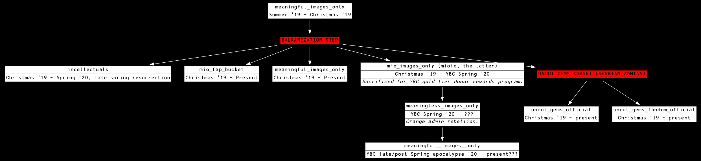

# LOREGRAPH

The incellectuals/meaningful images only lore.

# THE STATE OF THE LORE

# CONTRIBUTING

## FOR NON-CODERS

Start an issue and upload a modified version of the lore graph contained here
with your updates drawn onto it and someone with coding abilities will possibly
implement it.

## FOR CODERS

Install [`graphviz`](https://graphviz.org/download/), which includes the `dot`
command used to turn `LORE.dot` into image files. Fork the repo and clone your
copy; you will work from this copy and submit pull requests to this repository.

The repo is very simple and includes a `Makefile` with commands for rendering
the graph. Run `make help` to see them. Submit a pull request if you'd like to
update the graph.
